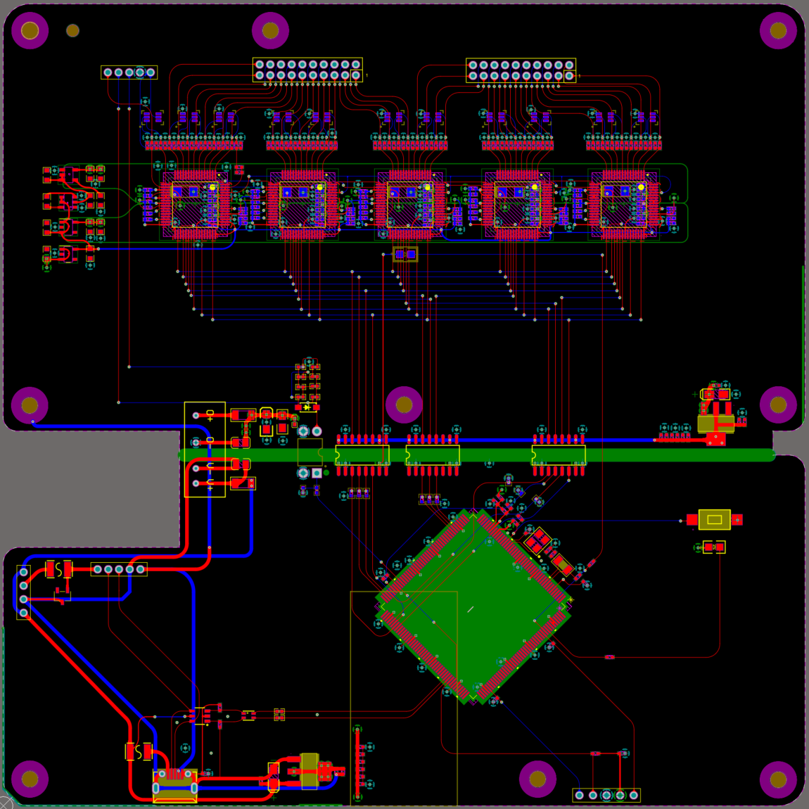

Codes for 40-channel EEG acquisition device, stm32h743iit6_ads1299_virtual_serial_port.

The present experimental code is developed within the Keil 5 development environment. It employs the ADS1299 chip for the acquisition of electroencephalogram (EEG) signals, with the STM32H743IIT6 serving as the primary control unit. Communication with the host computer is established through a virtual serial port interface. This project is experimental in nature and continues to be expanded and updated. In addition to the acquisition function, this code also has preliminary error chip reporting, device performance testing and other functions.

